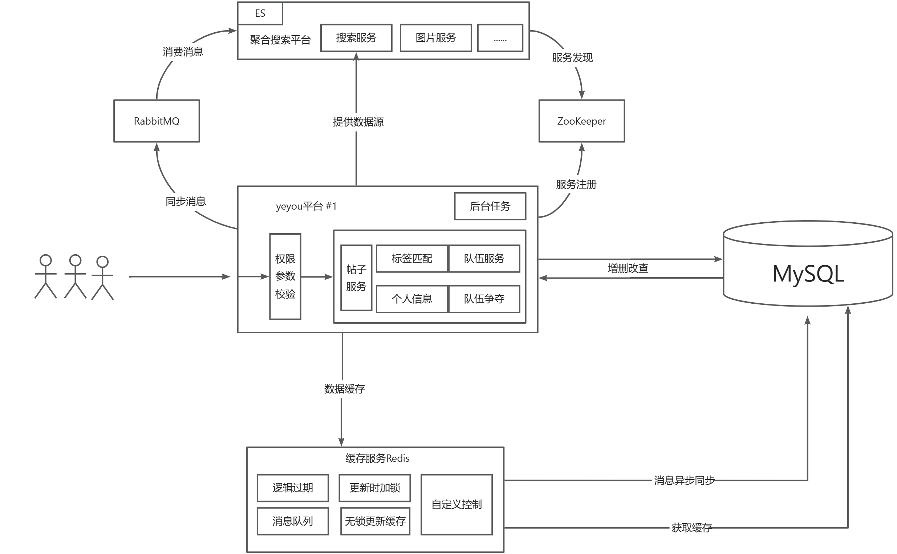

# 夜友平台

## 介绍
这是一个用于寻找队友的平台。可以通过标签来匹配有共同爱好的队友，也可以选择参加小伍来加入一个圈子。方便大家找到志同道合的伙伴或者圈子。
功能包括：用户登录注册、标签匹配、队伍查询、更新个人信息和标签、新标签添加、热门队伍争夺。
## 项目背景
在学校里，我们可能会经常遇到需要伙伴一起结伴的场景，比如课程设计需要组建小队、周末想和人出去散散心、打游戏找不到合适的队友等等。但是目前来说，我们只能找到身边的朋友，想要扩大自己的圈子，寻找更多志同道合的朋友是比较困难的。如果在学校里能有一个平台来寻找感兴趣的伙伴和圈子，能够极大的提高校园生活的乐趣。
## 项目意义
提供了一个伙伴匹配的平台，方便大学生在校园内寻找志同道合的伙伴。通过这个平台，不仅能够寻找到有同样兴趣的伙伴，也能找适合自己的圈子。说不定就找到新大陆了(*^▽^*)！
## 项目亮点

校园内暂时没有此类平台，并且功能简约，使用起来非常方便。目标群体为大学生，用户群体质量较高，能够高效查询到所需的内容。

编写了Redis缓存工具类，能够方便的添加缓存。该工具类针对缓存击穿、缓存穿透、缓存雪崩有了一定的优化。

灵活使用Redis，对热点数据进行缓存，极大的提高了系统的TPS，比如标签匹配请求，使用Redis缓存相比直接查询Mysql QPS提高了304%

使用Redis构建了一个消息队列，异步处理业务，配合Lua脚本，保障了队伍争夺业务的可靠性。

## 业务流程图

## 主体设计
### 1.用户服务
#### - 用户登录
参数：UserLoginRequest
1. 判断参数是否为空
2. 校验账号密码信息
3. 将用户信息token缓存到Redis中
4. 返回登录成功，同时返回用户VO信息方便前端使用
#### - 用户注册
参数：UserRegisterRequest
1. 判断参数是否为空
2. 检查账号密码是否符合规范
3. 用户名不能重复
4. 分配设置用户编号、设置用户角色
#### - 用户信息修改
### 3.标签服务
#### - 标签匹配
1. 使用逻辑过期缓存，将所有用户的标签信息缓存到Redis中，方便后续直接使用
2. 读取到标签信息后，在内存中对标签信息进行灵活处理
#### - 心动模式
1. 使用前面设计的标签缓存，使用编辑距离算法，得到标签最接近的用户
2. 封装用户信息并排序，返回
#### - 随机匹配
1. 设计高效的sql语句，随机获取用户
#### - 添加新标签
1. 新增标签，同时删除缓存，保证标签的实时性
#### - 编辑自己的标签
1. 获取从缓存获取所有的标签，然后能够对自己的标签进行修改
### 4.队伍服务
#### - 新增队伍
#### - 搜索队伍
1. 灵活使用AND和OR拼接sql语句，支持自定义查询
#### - 设置队伍状态
1. 可以设定公开、私有、密码、争夺四种状态
#### - 加入队伍
### 5.队伍争夺
#### - 设置队伍状态为争夺
1. 将队伍信息缓存到Redis中，如果要修改队伍信息则删除缓存
2. 缓存可加入的人数，用户后面使用使用lua脚本来验证队伍信息
#### - 加入队伍
1. 验证队伍信息，包括队伍状态验证，开始时间过期时间等等
2. 执行lua脚本，提交请求后等待异步处理
### 6.缓存设计
1. 针对数据量大的请求做缓存，比如所有用户的标签
2. 针对高频使用的请求做缓存，比如获取标签
3. 频繁更新且实时性要求高的请求不做缓存，但是要优化mysql查询（使用explain）
### 7.拦截器设计
#### - Token刷新服务
1. 每个请求均会被拦截，通过Redis验证用户携带的Token信息，将用户数据缓存到ThreadLocal中（如果用户修改信息，也会更新
ThradLocal），然后在Redis中更新过期时间
2. 如果Token验证失败则ThreadLocal为null
#### - 登录验证服务
1. 如果是OPTION请求则放行
2. 检查ThradLocal内的数据，如果为空则表示用户未登录，并拒绝请求
### 8.定时服务
#### - 给优质用户提前缓存数据
#### - 定时同步Redis和Mysql的数据
